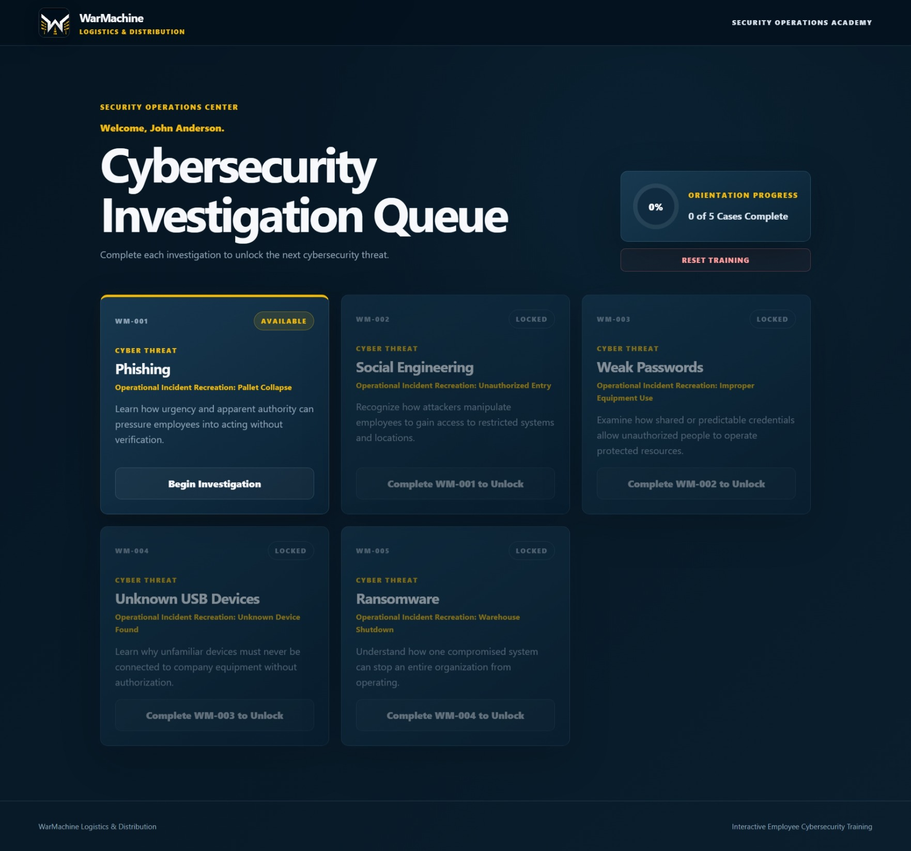

# 🛡️ Project IronGate
### Interactive Cybersecurity Training Platform


Interactive cybersecurity awareness platform that transforms traditional security training into an immersive, scenario-driven learning experience using realistic warehouse analogies and professionally produced operational incident videos.

<p align="center">
  
</p>

---

# 🚀 Live Demo

[](https://grgdougall-crypto.github.io/project-irongate/)

**Live Website**

https://grgdougall-crypto.github.io/project-irongate/

---

# 📖 Overview

Project IronGate is an interactive cybersecurity awareness platform designed to engage employees through realistic operational scenarios instead of traditional slide-based training.

Learners investigate warehouse incidents that parallel common cybersecurity threats, analyze what went wrong, answer knowledge checks, receive immediate feedback, and complete the training with a personalized Certificate of Operational Readiness.

The project demonstrates how physical workplace safety concepts can be leveraged to improve cybersecurity awareness through immersive, scenario-based instruction.

---

# ✨ Features

- 🎥 Five professionally produced operational incident training videos
- 🏭 Warehouse-based cybersecurity analogies
- 🧠 Interactive scenario-based learning
- 👤 Personalized learner experience
- 📊 Automatic progress tracking
- 💾 Browser-based save and resume functionality
- 🏆 Printable Certificate of Operational Readiness
- 📱 Responsive desktop and mobile design
- ♿ Keyboard accessibility and reduced-motion support
- 🌐 Live deployment using GitHub Pages

---

# 🛠️ Technologies Used

- HTML5
- CSS3
- JavaScript (ES6)
- HTML5 Video
- Local Storage API
- Git
- GitHub
- GitHub Pages
- Visual Studio Code
- DaVinci Resolve

---

# 📁 Project Structure

```
project-irongate/
│
├── index.html
├── styles.css
├── app.js
├── cases.js
│
├── assets/
│   ├── images/
│   └── videos/
│
└── README.md
```

| File | Description |
|------|-------------|
| `index.html` | Application structure and interface |
| `styles.css` | Styling, layout, responsive design, accessibility |
| `app.js` | Navigation, learner progress, scoring, certificates |
| `cases.js` | Training scenarios and assessment content |
| `assets/images` | Logos and interface graphics |
| `assets/videos` | Operational incident training videos |

---

# 🚀 Getting Started

1. Clone or download the repository.
2. Open the project in Visual Studio Code.
3. Launch with **Live Server** or open `index.html` directly in your browser.

No installation or build process is required.

---

# 🎯 Training Modules

Project IronGate currently includes five cybersecurity investigations:

- 📧 Phishing
- 🗣️ Social Engineering
- 🔑 Weak Passwords
- 💾 Unknown USB Devices
- 🔒 Ransomware

Each investigation combines a realistic operational incident video with guided analysis, cybersecurity instruction, and an interactive assessment.

---

# 🏆 Certificate of Completion

After successfully completing all investigations, learners receive a personalized **Certificate of Operational Readiness** that includes:

- Learner name
- Completion date
- Employee ID
- Printable one-page certificate layout

---

# 🔄 Reset Training Progress

Training progress can be reset by either:

- Selecting **Reset Training Progress** on the completion screen

or

Running the following command from the browser developer console:

```javascript
resetIronGateProgress();
```

---

# 📈 Development History

## Version 2.1

- Introduced the WarMachine Logistics & Distribution identity
- Added enterprise branding and Security Operations Academy
- Improved interface styling and certificate presentation

## Version 2.2

- Reduced header size
- Optimized logo scaling
- Simplified navigation
- Improved certificate printing

## Version 2.3

- Restored gold button hover effects
- Refined certificate logo treatment
- Improved print formatting

## Version 3.0

- Added dedicated print-only Certificate of Operational Readiness
- Automatic completion date
- One-page landscape certificate layout

## Version 3.1

- Added learner personalization
- Browser-based progress saving
- Personalized certificates
- Dashboard reset functionality

## Final Polish

- Removed legacy styling
- Improved accessibility
- Added keyboard focus states
- Added reduced-motion support
- Standardized animations and transitions

## Version 4.0

- Integrated five operational incident videos
- Replaced placeholders with HTML5 video playback
- Dynamic video loading
- Automatic video pause between investigations

### Included Videos

- WM-001 — Phishing
- WM-002 — Social Engineering
- WM-003 — Weak Passwords
- WM-004 — Unknown USB Devices
- WM-005 — Ransomware

## Version 4.1

- Removed autoplay
- Learner-controlled video playback
- Improved video loading performance
- Updated operational terminology
- Improved GitHub Pages compatibility
- Portfolio publication release

---

# 🔮 Future Enhancements

Potential future improvements include:

- Learning Management System (LMS) integration
- SCORM/xAPI compatibility
- Administrative dashboard
- Completion analytics
- User authentication
- Multi-language support
- Additional cybersecurity training modules

---

# 👨‍💻 Author

**Greg Dougall**

Project IronGate demonstrates front-end web development, interactive instructional design, and cybersecurity awareness training through immersive, scenario-based learning.

**GitHub:** https://github.com/grgdougall-crypto

---

## ⭐ Feedback

If you have suggestions for improvements or enhancements, feel free to open an issue or submit a pull request.
